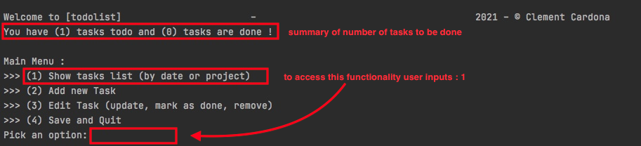
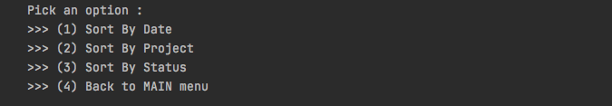
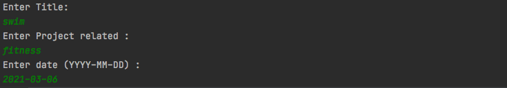
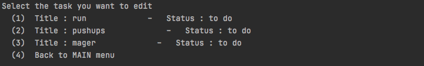
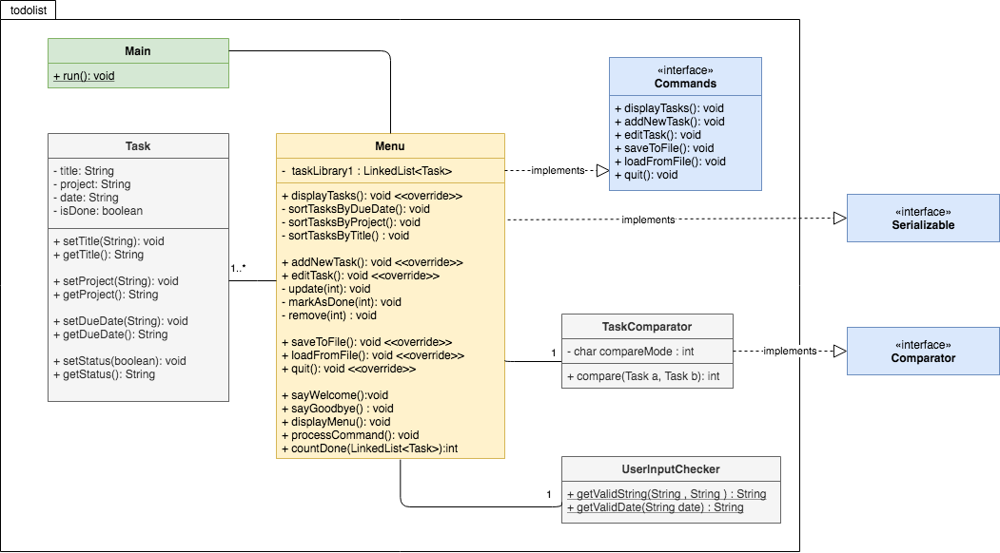

# todolist 

 

## Table of contents

* [General info](#general-info)
* [Technologies](#technologies)
* [Setup](#setup)
* [Screenshots](#setup)
* [Class diagram](#class-diagram)

## General info

This project is a small application that allows you to create, maintain and edit your own TODO list.

## Technologies

Project is created with:

* Maven: 3.6.3
* JDK: 15.0.2

## Setup

This project run on IDE console. User navigates in the menus by selecting actions through an associated number (1) or (
2) etc..

## Screenshots

### todolist.Main menu

### Show tasks list menu

### Add new task menu

### Edit task menu

### Save and quit menu

## Class Diagram

  

## Illustrations

