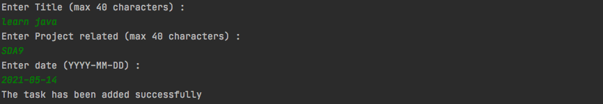
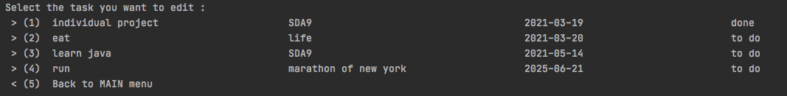
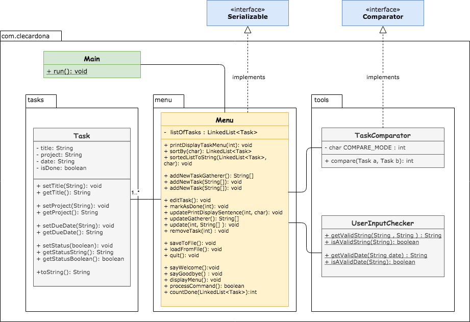

#  [ todolist ]


## Table of contents

+ [General info](#general-info)
+ [Technologies](#technologies)
+ [Setup](#setup)
+ [Functionalities](#functionalities)
+ [Screenshots](##etup)
+ [Class diagram](#class-diagram)

## General info

This project is a small application that allows you to create, maintain and edit your own TODO list.

## Technologies

Project is created with:

* Maven: 3.6.3
* JDK: 15.0.2

## Setup

This project runs on IDE console. User navigates through the menu by selecting actions associated number (1) or (2)
etc..
 
 

### Maven installation
***
 

Project has been build using **Apache maven 3.6.3**
More info about maven : https://maven.apache.org/

#### Install Maven with Homebrew ( Mac OSX )

If for some reason you do not have Homebrew installed on your Mac machine, you can quickly install Homebrew by running
the following command:

```shell
/usr/bin/ruby -e "$(curl -fsSL https://raw.githubusercontent.com/Homebrew/install/master/install)"
```

To install Maven with Homebrew, open terminal window on your Mac OS and type the following command:

```shell
brew install maven
```

Once the download is complete, verify the installation by running the following command:

```shell
mvn -v
```

This will print the current version of maven install on your computer, together with some additional details. For
example:

```shell
mvn -v
Apache Maven 3.3.9 (bb52d8502b132ec0a5a3f4c09453c07478323dc5; 2015-11-10T11:41:47-05:00)
Maven home: /usr/local/Cellar/maven/3.3.9/libexec
Java version: 1.8.0_121, vendor: Oracle Corporation
Java home: /Library/Java/JavaVirtualMachines/jdk1.8.0_121.jdk/Contents/Home/jre
Default locale: en_US, platform encoding: UTF-8
OS name: "mac os x", version: "10.11.6", arch: "x86_64", family: "mac"

```
Maven is now installed on your computer!
 
 

#### Install Maven on Windows :
[Video Tutorial to install Maven on Windows ](https://www.youtube.com/watch?v=RfCWg5ay5B0)


### Getting started
***
Steps to run the **[todolist]** app. After your IDE is open and files imported, do the following:

> 1. Go to src > main > java > com.clecardona

> 2. Select Main.java

> 3. Right click > Run main  ( ^⇧R )

## Functionalities

- Show task lists and sort them by *project*,*date* or *status*
- Create a new task
- Edit existing tasks *mark as done*,*update data*
- Saving your list into a file

## Screenshots

### Main menu

***


### Show tasks list menu (sorting)

***


#### Example of sorting by due date:


### Add a new task 
#### Status will be set as "to do" 
***


### Edit task menu

***


### Save and quit menu

***


## Class Diagram

***
  

